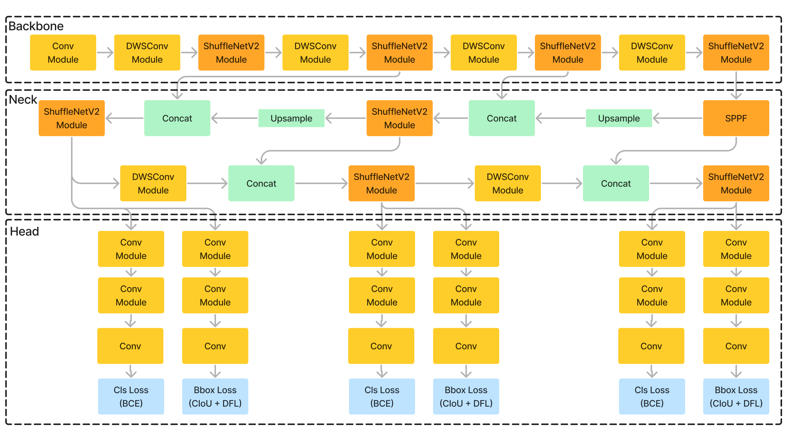

# YOLOv8 Model Compression with Lightweight Backbone and Convolutional Layers

This project focuses on model compression of the YOLOv8 object detection model by scaling and modifying the base model architecture and replacing it with a more efficient and lightweight backbone along with optimized convolutional layers. The goal is to reduce the computational requirements of the YOLOv8 model without compromising its performance, making it more suitable for deployment in resource-constrained environments.

## Features

- **YOLOv8 Base Model Modification**: The original YOLOv8 architecture has been modified to include a lightweight backbone (ShuffleNetV2).
- **Optimized Convolutional Layers**: The convolution layers have been replaced with more efficient partial depth-wise convolutiona layers to reduce the model's computational overhead while maintaining high accuracy.
- **Model Compression**: Reduces the size of the model and improves inference speed without significant loss of detection performance.
- **Modules**: The new lightweight modules including ShuffleNetV2 and PDW Convolutional Layers are provide in the nn directory which is a part of ultralytics official repository.

## Model Architecure



## Requirements

- Python 3.10.x
- PyTorch (compatible version)

## Installation

Clone the repository:

```bash
git clone https://github.com/Jayant71/Eff-Yolov8.git
cd Eff-Yolov8.git
```

Create environment and install pytorch:

```bash
conda create -n <env_name> python 3.10
conda activate <env_name>
pip install torch==2.2.0 torchvision==0.17.0 torchaudio==2.2.0 --index-url https://download.pytorch.org/whl/cu121 # https://pytorch.org/get-started/previous-versions/
```

Install ultralytics in editable format

```bash
cd ultralytics
pip install -e .
```

replace the nn directory or add the lightweight modules in nn/task.py, nn/modules/**init**.py, nn/modules/block.py, nn/modules/conv.py

Sample notebooks and model configurations are provide in dev/notebooks and dev/cfg directories.
